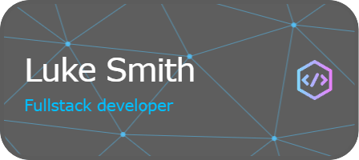

# 👋 Hey there, I'm Luke Smith!

 

🌐 [Check out my Portfolio](https://lukesmith25.github.io/PortfolioWebsite/)

## About Me 🚀

I'm a software engineer driven by innovation and problem-solving. Graduating from Baylor University with a major in Software Engineering and a minor in Business Administration, I've explored various domains, always aiming to create impactful solutions.

## 🧰 Languages & Tools

- **Languages:** Advanced C++, Advanced Java, Advanced JavaScript, Intermediate SQL, Advanced Beginner Python,
Intermediate Bash, Advanced Beginner Nodejs
- **Frameworks:** Nextjs, React, TailwindCSS
- **Tools:** Java Spring Framework, Java Swing, GitHub, JetBrains IDEs, Figma, Visual Paradigm, SDL Plotter

## 🌟 Highlights

- **CTO / Lead Software Engineer at Vlyss**: Led the development of an anti-fraud blockchain solution using an array of modern web technologies, with a strong focus on agile methodologies and quality deliverables.

## 🔥 Projects

- **Anti-Fraud Blockchain Solution (Vlyss)**: A Solana blockchain-based solution designed with a user-centric approach. It integrates multiple layers of security to ensure both protection and a seamless user experience.
  
- **Hotel Reservation System**: A comprehensive system, leveraging Java and the Spring Framework, aiming to enhance guest satisfaction and optimize room utilization.

## 🤝 Let's Connect!

Always open to collaboration, discussions about tech, or brainstorming on innovative ideas. Feel free to connect with me through my portfolio!
